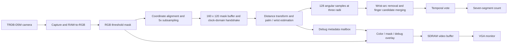

# FPGA Finger Counting on the DE2-115

A collaborative undergraduate capstone project that implements a camera-to-display finger-counting pipeline in Verilog for the Terasic DE2-115 and TRDB-D5M camera.

The design segments a hand, estimates its palm and wrist, and counts extended fingers from circular samples of the binary silhouette. The result is stabilized over successive analyses and displayed on the board's seven-segment display. VGA output provides color, mask, and geometry views for debugging.

**Review guide:** read the [project summary](docs/PROJECT_SUMMARY.md), then explore the [architecture](docs/ARCHITECTURE.md) and [hardware results](docs/VALIDATION.md).

## Project at a glance

| Item | Implementation |
| --- | --- |
| FPGA board | Terasic DE2-115, Cyclone IV E `EP4CE115F29C7` |
| Camera | Terasic TRDB-D5M |
| Language | Verilog |
| Camera processing mode | 800 × 600 |
| Analysis mask | 160 × 120, sampled every five pixels in each direction |
| Analysis clock | 50 MHz (`CLOCK2_50`) |
| Count output | 0–5; `E` when no reliable stabilized result is available |
| Algorithm | Two-pass chamfer distance transform and multi-radius arc analysis |
| FPGA development tools | Quartus Prime Lite 18.1 |

This repository documents the V2 implementation. The supplied Quartus summaries report 8,002 logic elements (7%) and 249,400 memory bits (6%). See [hardware results and build summaries](docs/VALIDATION.md).

## Hardware demonstration

Hardware testing on the DE2-115 demonstrated finger counts 0–5 against a green-cloth background. Occasional errors remain for the closed-fist/zero case.

This is a functional demonstration under the reported setup. No trial counts, aggregate accuracy, measured frame rate, or latency are available, so no quantitative performance claim is made.

## System architecture



The analysis uses integer geometry rather than a trained model. The camera, SDRAM, VGA, and generated IP infrastructure includes code inherited from Terasic/Altera; see [third-party notices](THIRD_PARTY_NOTICES.md).

## Engineering highlights

- **End-to-end FPGA implementation:** the system integrates camera input, Verilog image analysis, VGA diagnostics, and a stabilized seven-segment result, with a working 0–5 hardware demonstration under a green-cloth setup.
- **Hardware-oriented geometry:** a two-pass 3/4 chamfer transform estimates the palm center and radius without floating-point arithmetic.
- **Orientation handling:** the wrist direction is estimated from image-edge contact, so finger candidates are not restricted to the top of the image. This is an algorithmic capability, not a measured guarantee for every hand orientation.
- **V2 candidate filtering:** connected wrist arcs are removed; only candidates reaching the 1.875R or 2R circles can increase the count. Cross-ring merging reduces duplicate candidates.
- **Clock-domain integration:** mask ownership and debug metadata are transferred through explicit handshakes; reset release is synchronized in each domain.
- **Observable behavior:** board switches expose the mask, palm center, acceptance circles, raw count, error code, and vote support.

## Quick start

To build the FPGA project, open `DE2_115_CAMERA.qpf` in Quartus Prime Lite 18.1, or use:

```powershell
.\build.ps1 -QuartusRoot C:\intelFPGA_lite\18.1\quartus
```

See [setup and board operation](docs/SETUP.md) for hardware connections, programming, switches, and debugging.

## Repository layout

```text
DE2_115_CAMERA.v          Top-level integration
DE2_115_CAMERA.qpf        Quartus project
DE2_115_CAMERA.qsf        Device, pin, and source assignments
DE2_115_HAND.sdc          Timing constraints
VGA_Param.h              Fixed video-mode selection
hand_detection/          Mask capture, geometry, voting, and overlays
v/                       Camera, RGB, VGA, I2C, and generated IP support
Sdram_Control/           SDRAM controller and FIFO support
build.ps1                Original FPGA build script
docs/                    Project summary, architecture, setup, and results
docs/evidence/           Selected Quartus build summaries
THIRD_PARTY_NOTICES.md    Source provenance and publication review notes
```

Build databases, temporary simulation binaries, backup files, and bitstreams are excluded from source control. A verified bitstream can be distributed separately as a GitHub Release after the team reviews publication rights and records its source revision and checksum.

## Operating assumptions and limitations

The intended starting setup is one hand, a green background, visible finger gaps, a central palm, and an arm entering through an image edge. This snapshot assumes 800 × 600 input, a scale factor of five, and two clocks of RAW-to-RGB coordinate latency.

Touching or occluded fingers, strong perspective changes, similar-colored background objects, and lighting changes can degrade the binary mask. Short extended fingers may miss the acceptance circle; folded fingers protruding far enough may be counted. Temporal voting reduces fluctuation but cannot correct a consistently incorrect silhouette interpretation.

The supplied SDC leaves external camera, SDRAM, and VGA I/O timing incompletely constrained. The reported hardware demonstration does not establish performance across arbitrary people, lighting conditions, or backgrounds.

## Team and attribution

This capstone was developed jointly by two students, with most work carried out together. A brief [team acknowledgment](docs/AUTHORS.md) records this shared contribution.

No repository-wide open-source license has been selected. Existing Terasic/Altera notices are retained. Publication and licensing of inherited sources must be reviewed before public upload; adding an MIT license to the whole repository would not resolve those terms.
